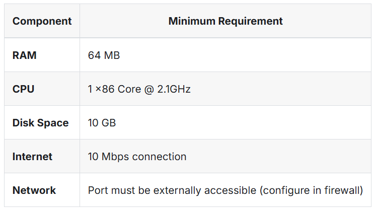

# 0G-AI-Alignment-Node-Guide-Remake-by-P2Pnodetop
Step-by-step guide to set up and run a 0G AI Alignment Node, including installation, configuration, and operation instructions with example commands and images. Designed for both beginners and experienced node operators.

# 1. System Requirements


# 2. Installation & Setup
Step 1: Install dependencies, if needed

```bash
install dependencies, if needed
sudo apt update && sudo apt upgrade -y
sudo apt install curl git wget htop tmux build-essential jq make lz4 gcc unzip -y

Install Go
```bash
wget https://go.dev/dl/go1.22.3.linux-amd64.tar.gz
sudo tar -C /usr/local -xzf go1.22.3.linux-amd64.tar.gz
echo "export GOROOT=/usr/local/go" >> ~/.bash_profile
echo "export GOPATH=\$HOME/go" >> ~/.bash_profile
echo "export PATH=\$GOPATH/bin:\$GOROOT/bin:\$PATH" >> ~/.bash_profile
source ~/.bash_profile

Download the latest 0G alignment node binary from the official repository:
```bash
wget https://github.com/0gfoundation/alignment-node-release/releases/download/v1.0.0/alignment-node.tar.gz
tar -xzf alignment-node.tar.gz
cd alignment-node
chmod +x 0g-alignment-node

Step 2: Configure Environment
a. Copy the example environment file:
```bash
cp .env.example .env

b. Edit the .env file with your configuration:
```bash
nano .env

c. Configure the following parameters:
```bash
export ZG_ALIGNMENT_NODE_LOG_LEVEL=debug
export ZG_ALIGNMENT_NODE_SERVICE_IP="http://127.0.0.1:34567"  # Example: http://36.50.176.xxx:34567
export ZG_ALIGNMENT_NODE_SERVICE_PRIVATEKEY= Enter the private key that holds the NFT here, omit the 0x


